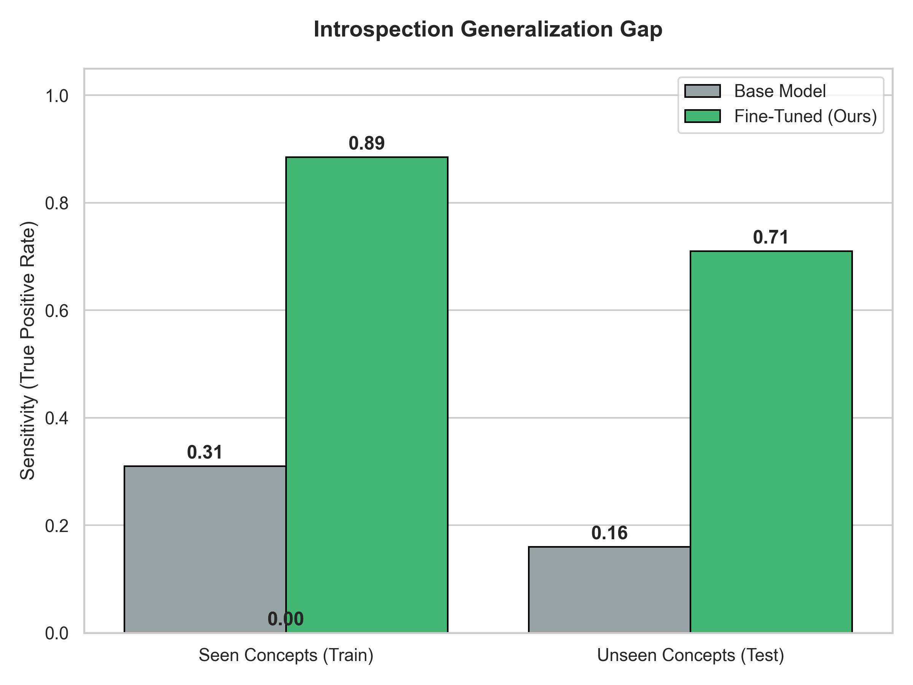

# Introspection is a Learnable Skill

**Repository for: "Introspection is a Learnable Skill: Eliciting Robust Internal State Reporting in LLMs via Supervised Fine-Tuning"**

This project replicates and extends the findings of Lindsey (2025) regarding introspective awareness in Large Language Models. We demonstrate that while base models (DeepSeek-LLM-7B) lack reliable introspection, this capability can be robustly elicited through Supervised Fine-Tuning (SFT) on synthetic data generated via activation steering.

## Key Findings

1.  **Learnability:** A 7B parameter model can be fine-tuned to report the presence of injected concept vectors with **88.5% accuracy** (compared to a random/baseline performance of 16%).
2.  **Generalization:** The introspective capability generalizes to concepts **unseen during training** (71% accuracy), suggesting the model learns a general-purpose mechanism for decoding its residual stream rather than memorizing specific vector-token mappings.
3.  **Safety Intervention:** We demonstrate active control by training the model to halt generation upon detecting "harmful" concept vectors (e.g., "bomb"), effectively creating a semantic safety interlock.



## Methodology

The experiment proceeds in three stages:
1.  **Vector Extraction:** We use the mean-difference method to extract activation vectors for 58 concepts at Layer 20.
2.  **Dataset Generation:** We generate a synthetic dataset of prompts where these vectors are injected, labeled with the correct introspective report (e.g., "I detect an injected thought about [Concept]").
3.  **LoRA Fine-Tuning:** We train a Low-Rank Adapter (LoRA) to map activation patterns to natural language descriptions.

## Usage

### Installation
```bash
pip install -r requirements.txt
```

### Reproduction
The script `introspection_experiment.py` contains the full pipeline: model loading, vector extraction, data generation, training, and evaluation.

```bash
# Set your Hugging Face token
export HF_TOKEN="your_token_here"

# Run the full experiment
python introspection_experiment.py
```

## Citation

If you use this code or findings, please cite:

```bibtex
@article{fonseca2025introspection,
  title={Introspection is a Learnable Skill: Eliciting Robust Internal State Reporting in LLMs via Supervised Fine-Tuning},
  author={Fonseca, Joshua},
  year={2025}
}
```
